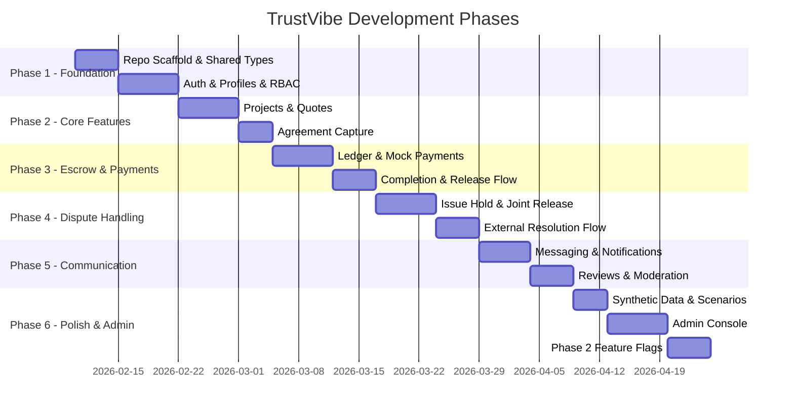

# TrustVibe - Detailed Workplan

> **Project:** TrustVibe - Bilingual iOS-First Marketplace for Puerto Rico  
> **Version:** 1.0 MVP + Phase 2 (Feature-Flagged)  
> **Last Updated:** 2026-02-08

---

## Executive Summary

TrustVibe is a bilingual (Spanish/English) iOS-first mobile marketplace connecting Customers with Contractors in Puerto Rico. The platform provides an escrow-style payment hold service to reduce fraud and improve payment reliability. Built for Windows development with cloud-based iOS publishing.

---

## 1. Project Phases Overview



---

## 2. Repository Structure

```
trustvibe/
├── apps/
│   ├── mobile/                    # React Native + Expo (TypeScript)
│   │   ├── src/
│   │   │   ├── components/        # Reusable UI components
│   │   │   ├── screens/           # Screen components by role
│   │   │   │   ├── auth/
│   │   │   │   ├── customer/
│   │   │   │   ├── contractor/
│   │   │   │   └── shared/
│   │   │   ├── navigation/        # React Navigation setup
│   │   │   ├── hooks/             # Custom hooks
│   │   │   ├── services/          # API/Firebase services
│   │   │   ├── store/             # Zustand stores
│   │   │   ├── theme/             # Design system tokens
│   │   │   └── utils/             # Utility functions
│   │   ├── app.json
│   │   ├── eas.json               # EAS Build config
│   │   └── package.json
│   │
│   └── admin/                     # Next.js Admin Console
│       ├── src/
│       │   ├── components/
│       │   ├── pages/
│       │   ├── hooks/
│       │   └── services/
│       └── package.json
│
├── functions/                     # Firebase Cloud Functions
│   ├── src/
│   │   ├── auth/
│   │   ├── projects/
│   │   ├── quotes/
│   │   ├── agreements/
│   │   ├── escrow/
│   │   ├── messaging/
│   │   ├── reviews/
│   │   ├── admin/
│   │   └── providers/
│   │       ├── payments/
│   │       │   ├── PaymentProvider.ts
│   │       │   ├── MockPaymentProvider.ts
│   │       │   └── StripeConnectProvider.ts  # Stubbed
│   │       └── notifications/
│   │           ├── NotificationProvider.ts
│   │           ├── MockEmailProvider.ts
│   │           └── SendGridProvider.ts       # Stubbed
│   └── package.json
│
├── packages/
│   └── shared/                    # Shared code across apps/functions
│       ├── types/                 # TypeScript interfaces
│       ├── schemas/               # Zod validation schemas
│       ├── constants/             # Status enums, config keys
│       ├── i18n/
│       │   ├── en.json
│       │   └── es.json
│       └── package.json
│
├── scripts/
│   ├── seed.ts                    # Seed emulators with demo data
│   └── scenarios/
│       ├── happy_path_release.ts
│       ├── issue_then_joint_release_partial.ts
│       └── issue_then_external_resolution_refund_full.ts
│
├── data/
│   └── demo/                      # Static JSON demo data
│       ├── users.json
│       ├── contractors.json
│       ├── projects.json
│       ├── quotes.json
│       └── municipalities.json
│
├── docs/
│   ├── architecture.md
│   ├── escrow_hold_state_machine.md
│   ├── api.md
│   ├── windows_runbook.md
│   ├── translation_glossary.md
│   ├── assumptions.md
│   ├── workplan.md                # This file
│   └── tasks.md
│
├── firebase.json
├── firestore.rules
├── firestore.indexes.json
├── storage.rules
├── .firebaserc
├── package.json                   # Root monorepo config
├── turbo.json                     # Turborepo config (optional)
└── README.md
```

---

## 3. Development Phases - Detailed

### Phase 1: Foundation (Sprints 1-2)

#### 1.1 Repository Scaffold & Shared Types
| Task | Description | Deliverables |
|------|-------------|--------------|
| Monorepo Setup | Initialize with npm workspaces or yarn workspaces | `package.json`, workspace configs |
| Mobile App Shell | Expo + React Native + TypeScript | `apps/mobile/` structure |
| Admin Console Shell | Next.js + TypeScript | `apps/admin/` structure |
| Firebase Functions | Cloud Functions with TypeScript | `functions/` structure |
| Shared Package | Types, schemas, constants, i18n | `packages/shared/` |
| i18n Skeleton | Set up i18next with EN/ES placeholders | `en.json`, `es.json` |
| Navigation Shells | React Navigation (mobile), Next.js routing (admin) | Navigation configs |
| Design System Foundation | Theme tokens, base components | `theme/`, base components |

#### 1.2 Authentication & Profiles
| Task | Description | Deliverables |
|------|-------------|--------------|
| Firebase Auth Setup | Email/password auth with Firebase | Auth configuration |
| Role Selection | Customer vs Contractor selection UI | `RoleSelectScreen` |
| Login/Register | Email/password forms with validation | Auth screens |
| Password Reset | Password reset flow | Reset screen + email |
| Profile Setup | Basic profile (name, phone, municipality, photo) | Profile screens |
| RBAC Implementation | Role-based access control | Security rules, middleware |
| Security Rules Baseline | Firestore + Storage security rules | `firestore.rules`, `storage.rules` |

---

### Phase 2: Core Features (Sprints 3-4)

#### 2.1 Projects & Quotes
| Task | Description | Deliverables |
|------|-------------|--------------|
| Project Creation | Multi-step project listing form (Customer) | `CreateProjectScreen` |
| Project Listing | Browse/search open projects (Contractor) | `BrowseProjectsScreen` |
| Quote Submission | Submit quote with price, timeline, scope (Contractor) | `SubmitQuoteScreen` |
| Quotes Comparison | View and compare received quotes (Customer) | `QuotesCompareScreen` |
| Contractor Selection | Select contractor from quotes (Customer) | Selection flow |
| Project Detail Screen | Full project view with status, quotes, escrow | `ProjectDetailScreen` |
| Search & Filter | By category, municipality, rating | Filter components |

#### 2.2 Agreement Capture
| Task | Description | Deliverables |
|------|-------------|--------------|
| Agreement Snapshot Generation | Generate immutable agreement on selection | Cloud Function |
| Agreement Review Screen | Display agreement terms for review | `AgreementReviewScreen` |
| Dual Acceptance Flow | Both parties accept (checkbox + timestamp) | Acceptance logic |
| Agreement Storage | Immutable Firestore document | `agreements/` collection |

---

### Phase 3: Escrow & Payments (Sprints 5-6)

#### 3.1 Ledger & Payment Infrastructure
| Task | Description | Deliverables |
|------|-------------|--------------|
| PaymentProvider Abstraction | Interface for payment operations | `PaymentProvider.ts` |
| MockPaymentProvider | Fully working mock for MVP testing | `MockPaymentProvider.ts` |
| StripeConnectProvider Stub | Stubbed implementation with TODOs | `StripeConnectProvider.ts` |
| Ledger Module | Source of truth for all money movements | Ledger types + functions |
| Fee Configuration | Platform fee % stored server-side | `/config/platformFees` |
| Hold Policy Configuration | Deadline configs (N days, M days) | `/config/holdPolicy` |

#### 3.2 Escrow State Machine
| State | Description | Transitions |
|-------|-------------|-------------|
| `DRAFT` | Project being created | → `OPEN_FOR_QUOTES` |
| `OPEN_FOR_QUOTES` | Accepting quotes | → `CONTRACTOR_SELECTED`, `CANCELLED` |
| `CONTRACTOR_SELECTED` | Contractor chosen | → `AGREEMENT_ACCEPTED`, `CANCELLED` |
| `AGREEMENT_ACCEPTED` | Both parties signed | → `FUNDED_HELD`, `CANCELLED` |
| `FUNDED_HELD` | Customer funds held | → `IN_PROGRESS` |
| `IN_PROGRESS` | Work underway | → `COMPLETION_REQUESTED` |
| `COMPLETION_REQUESTED` | Contractor requests completion | → `APPROVED_FOR_RELEASE`, `ISSUE_RAISED_HOLD` |
| `APPROVED_FOR_RELEASE` | Customer approved | → `RELEASED_PAID` |
| `RELEASED_PAID` | Funds released to contractor | → `CLOSED` |
| `ISSUE_RAISED_HOLD` | Customer raised issue | → `RESOLUTION_PENDING_EXTERNAL` |
| `RESOLUTION_PENDING_EXTERNAL` | Awaiting resolution | → `RESOLUTION_SUBMITTED` |
| `RESOLUTION_SUBMITTED` | Resolution doc uploaded | → `EXECUTED_*` |
| `EXECUTED_RELEASE_FULL` | Full release executed | → `CLOSED` |
| `EXECUTED_RELEASE_PARTIAL` | Partial release executed | → `CLOSED` |
| `EXECUTED_REFUND_PARTIAL` | Partial refund executed | → `CLOSED` |
| `EXECUTED_REFUND_FULL` | Full refund executed | → `CLOSED` |
| `CLOSED` | Project completed | Terminal |
| `CANCELLED` | Project cancelled | Terminal |

#### 3.3 Fund Hold UI
| Task | Description | Deliverables |
|------|-------------|--------------|
| Fund Escrow Screen | Show total, fee, net payout, terms | `FundEscrowScreen` |
| Funding Flow | Customer funds with mock provider | Cloud Function + UI |
| Funds Held Indicator | Visual status for contractor | Status components |
| Fee Transparency | Display all fee breakdowns | Fee display components |

#### 3.4 Completion & Release
| Task | Description | Deliverables |
|------|-------------|--------------|
| Request Completion | Contractor submits completion + photos | `RequestCompletionScreen` |
| Customer Review | Customer sees completion request | Completion review UI |
| Approve Release | Customer approves, triggers release | Approval flow |
| Raise Issue | Customer raises issue, holds funds | `RaiseIssueScreen` |
| Auto-Release Timer | Deadline-based auto-release logic | Scheduled function |

---

### Phase 4: Dispute Handling (Sprints 7-8)

#### 4.1 Issue Hold & Joint Release
| Task | Description | Deliverables |
|------|-------------|--------------|
| Issue Hold State | Lock funds when issue raised | State transition |
| Joint Release Proposal | Either party proposes split | `ProposeJointReleaseScreen` |
| Joint Release Signature | Both parties e-sign in-app | Signature flow |
| Execution Without Admin | Auto-execute if within rules | Cloud Function |
| Reminder System | Periodic reminders for pending actions | Notification triggers |

#### 4.2 External Resolution Flow
| Task | Description | Deliverables |
|------|-------------|--------------|
| Resolution Upload | Upload settlement/court doc | `UploadResolutionScreen` |
| Admin Validation | Validate identity match + completeness | Admin review queue |
| Admin Execution | Execute outcome based on doc | Admin execute flow |
| Audit Trail | Full audit log of all actions | Audit logging |

---

### Phase 5: Communication (Sprints 9-10)

#### 5.1 Messaging
| Task | Description | Deliverables |
|------|-------------|--------------|
| Project-Scoped Thread | Messages between customer + contractor | `MessagesScreen` |
| Image Attachments | Send/receive images | Attachment handling |
| Real-time Updates | Firestore listeners for messages | Real-time sync |
| Message History | Load older messages | Pagination |

#### 5.2 Notifications
| Task | Description | Deliverables |
|------|-------------|--------------|
| Push Notification Setup | FCM + APNs via Expo | Notification config |
| Notification Provider | Interface + Mock + SendGrid stub | Provider structure |
| Notification Templates | Bilingual push/email templates | i18n templates |
| Notification Triggers | All key events trigger notifications | Event handlers |

#### 5.3 Reviews & Moderation
| Task | Description | Deliverables |
|------|-------------|--------------|
| Verified Reviews | Only after project CLOSED | Review submission |
| Rating System | 1-5 stars + tags + feedback | Rating components |
| Flag Review | User can flag inappropriate reviews | Flag flow |
| Moderation Queue | Admin review flagged content | Admin queue |

---

### Phase 6: Polish & Admin (Sprints 11-13)

#### 6.1 Synthetic Data & Scenarios
| Task | Description | Deliverables |
|------|-------------|--------------|
| Demo Data | Puerto Rico municipalities, bilingual text | `data/demo/` JSON files |
| Seed Script | Populate emulators | `scripts/seed.ts` |
| Happy Path Scenario | Full release flow | `happy_path_release.ts` |
| Joint Release Scenario | Issue then partial release | `issue_then_joint_release_partial.ts` |
| External Resolution Scenario | Full refund via court doc | `issue_then_external_resolution_refund_full.ts` |

#### 6.2 Admin Console
| Task | Description | Deliverables |
|------|-------------|--------------|
| Users Management | View, disable, set role, credential status | Users page |
| Projects Overview | View all projects with status | Projects page |
| Escrow Cases | View ledger timeline and documents | Cases page |
| Execute Outcome | Release/refund based on docs | Execution interface |
| Review Moderation | Hide/remove/restore flagged reviews | Moderation page |
| Config Management | Fee config, hold policy deadlines | Config page |
| Audit Log | View all admin actions | Audit page |

#### 6.3 Phase 2 Feature Flags
| Task | Description | Deliverables |
|------|-------------|--------------|
| Feature Flag System | LaunchDarkly or simple config flags | Flag infrastructure |
| Stripe Connect Activation | Flag to switch from mock to Stripe | Payment flag |
| Milestone Payments | Per-milestone holds/releases | Milestone stubs |
| Change Orders | In-app change order flow | Change order stubs |
| Credential Verification | Admin verification workflow | Verification stubs |
| Scheduling | Booking requests + reminders | Scheduling stubs |
| Recommendations | Rules-based contractor recommendations | Recommendation stubs |
| Referral/Growth | Referral codes, featured listings | Growth stubs |

---

## 4. Definition of Done

Every feature must satisfy:

| Criterion | Description |
|-----------|-------------|
| **UI States** | Loading, empty, error states implemented |
| **Bilingual** | All strings in i18n (EN/ES) |
| **Backend Secured** | Cloud Function + Firestore rules + validation |
| **Analytics** | Relevant Firebase Analytics events fired |
| **Tests** | Unit tests for logic; integration tests where applicable |
| **Documentation** | Relevant docs updated |

---

## 5. Testing Strategy

### Unit Tests (Jest)
- Escrow state transitions
- Fee calculations
- Hold policy timer logic
- Zod schema validations

### Integration Tests (Firebase Emulators)
- Project → Quote → Agreement → Fund → Completion → Approve → Release
- Issue Raised → Joint Release Signed → Execution
- Issue Raised → External Resolution → Admin Execute

### Manual QA (Physical iPhone)
- Full user flows on device via Expo Dev Build
- Documented checklist in `/docs/manual_qa_checklist.md`

---

## 6. Key Milestones

| Milestone | Target | Criteria |
|-----------|--------|----------|
| **M1: Foundation Complete** | Sprint 2 End | Auth, profiles, RBAC working on emulators |
| **M2: Core Flow Working** | Sprint 4 End | Project → Quote → Agreement on device |
| **M3: Happy Path Complete** | Sprint 6 End | Full escrow flow with mock payments |
| **M4: Dispute Handling** | Sprint 8 End | Joint release + external resolution |
| **M5: MVP Complete** | Sprint 10 End | Messaging, notifications, reviews |
| **M6: Admin & Polish** | Sprint 13 End | Full admin console, seed data, docs |
| **M7: TestFlight Submission** | Sprint 14 | App submitted to TestFlight |

---

## 7. Risk Register

| Risk | Likelihood | Impact | Mitigation |
|------|------------|--------|------------|
| EAS Build issues on Windows | Medium | High | Early testing with dev builds; documentation |
| Firebase cost overruns | Low | Medium | Monitor usage; emulator-first development |
| i18n string coverage gaps | Medium | Medium | Automated key coverage checks |
| Physical iPhone testing friction | Medium | Medium | Detailed runbook; multiple test devices |
| Stripe Connect complexity | High | High | Deferred to Phase 2; mock provider for MVP |

---

## 8. Team Assumptions

See `/docs/assumptions.md` for full list of assumptions made during planning.
